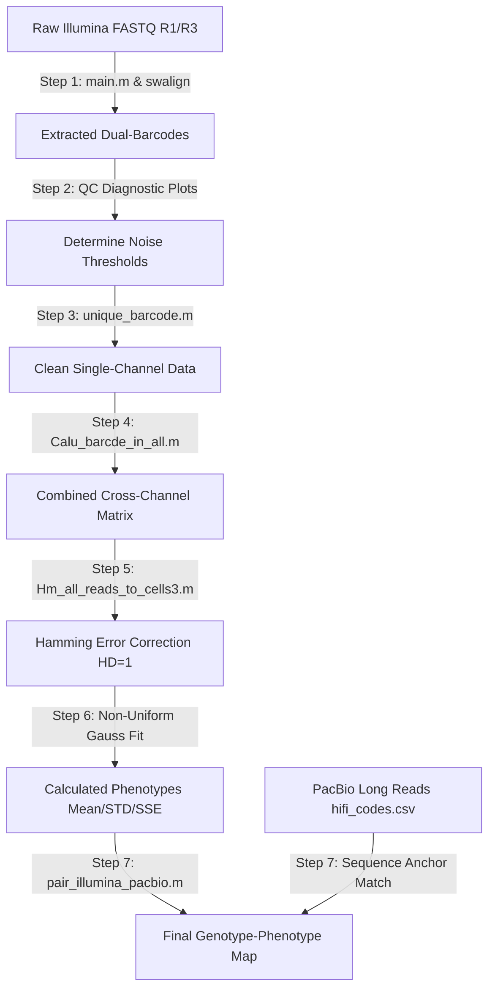

# 🧬 Sort-Seq Pipeline by Illumina
This repository contains a modular, high-performance MATLAB pipeline designed for **Sort-Seq (FACS-Seq) data analysis**. The workflow processes variant libraries (e.g., mStaygold, mTagBFP2 fluorescent proteins) carrying dual-barcodes to map phenotypic properties (fluorescence intensity levels) to specific genotypes.

By matching **Illumina short-read data** (cell counts per sorting gate) with **PacBio long-read data** (complete mutant sequences), this pipeline automatically reconstructs a highly precise, large-scale **Genotype-Phenotype map**.

---

## 🧭 Pipeline Architecture & Data Flow

---

## 📋 Requirements & Dependencies

To run this pipeline seamlessly, ensure your MATLAB environment includes the following toolboxes:

- **Bioinformatics Toolbox** (required for `swalign` local sequence alignments)

- **Curve Fitting Toolbox** (required for non-uniform custom Gaussian fitting)

- **Parallel Computing Toolbox** (required for `parfor` acceleration during processing)

---

## 🚀 Step-by-Step Standard Operating Procedure (SOP)

### Phase 1: Barcode Extraction & Quality Control

#### Step 1: Raw Dual-Barcode Extraction

- **Primary Script**: `main.m` (orchestrates `extract_dual_barcodes.m`, `resolve_conflict.m`, and `save_results.m`)

- **Objective**: Performs local Smith-Waterman alignment against a wild-type (WT) template to identify flanking regions and isolate the Primary and Secondary barcodes from R1/R2 pairs. R1/R2 orientation conflicts are automatically resolved via a joint quality-score probabilistic model.

- **Input**: Paired-end Illumina FASTQ files (e.g., `mTagBFP2-G8_R1.fastq`, `mTagBFP2-G8_R3.fastq`).

- **Output**: Unfiltered barcode lists (`uniqe_barcode_No_select_results_[Name].csv`) and Phred/ACC quality score distribution plots.

#### Step 2: Diagnostic Visualization

- **Primary Script**: `Draw_barcode_counts_for_threshold.m`

- **Objective**: Generates a 2×4 comprehensive histogram grid showing raw barcode copy number frequencies across all 8 sorting channels (g1 to g8).

- **Action Item**: Analyze the plots to observe the low-frequency sequencing noise tail. Use this visualization to determine your experimental noise cutoff (`threshold_counts`, typically set to 2–4).

#### Step 3: Single-Channel Denoising & Filtering

- **Primary Script**: `unique_barcode.m` (or parallelized alternative `From_No_select_unique_add_thold.m`)

- **Objective**: Removes sequencing artifacts. Filters out barcodes that do not match length constraints, contain illegitimate characters (any base outside of A, T, C, G, +), or fall below the copy number cutoff.

- **Output**: Sanitized single-channel matrix tables (`uniqe_barcode_results_mtbg[1-8].csv`).

### Phase 2: Cross-Channel Matrix Alignment & Error Correction

#### Step 4: Multi-Gate Compiling & Alignment

- **Primary Script**: `Calu_barcde_in_all.m`

- **Objective**: Re-aligns and aggregates independent barcodes from all 8 gates into a unified cross-channel master table. Missing cells or unobserved variants in a channel are padded with zero counts automatically.

- **Output**: `combined_barcode_counts_allgate.csv` and a consolidated workspace metadata file `barcode_in_allgate.mat`.

#### Step 5: Hamming Distance Correction & Strategy-Driven Read Conversion

- **Primary Script**: `Hm_all_reads_to_cells3.m`

- **Objective**:

    - Hamming Correction (HD=1): Identifies barcode pairs within a variant family that differ by exactly 1 base. If their count ratio is highly skewed, the lower-frequency barcode is treated as a replication/sequencing error and merged into the dominant primary barcode.

    - Reads-to-Cells Conversion: Implements advanced threshold strategies (e.g., Strategy 2) to translate raw sequencing read counts into estimated biological cell counts across the gates.

- **Output**: Denoised, cell-calibrated matrix file ready for phenotype mapping (`mean_std_count_diff_reads_to_cell_conbin_HM_[Threshold].csv`).

### Phase 3: Mathematical Fitting & Cross-Platform Mapping

#### Step 6: Non-Uniform Adaptive Gaussian Fitting

- **Primary Script**: `smart_gauss_fit_nonuniform.m`

- **Objective**: Computes the true expression phenotype using the distribution profile across channels. Instead of simple arithmetic indexing, it performs a weighted, non-uniform Gaussian fitting that dynamically detects single-peak vs. multi-peak distributions.

- **Output**: High-fidelity phenotypic indices including Mean ( $\mu$ ), Standard Deviation ( $\sigma$ ), and Sum of Squared Errors ( $SSE$ ).

🔬 Critical Warning: The array `g` or `gg` representing the sorting gate coordinates must be updated manually before running. These represent log10 fluorescence values and change with flow cytometer PMT voltages and gating setups on the day of the experiment.

#### Step 7: Cross-Platform Genotype-Phenotype Convergence

- **Primary Script**: `pair_illumina_pacbio.m` (utilizes `rev_complement.m`)

- **Objective**: Blends short-read and long-read worlds. Maps the calculated phenotypic values (Illumina) to full-length coding sequence genotypes (PacBio) using the shared barcodes as anchor points (supports reverse complement matching).

- **Output**: Final integrated mapping database `table_geno_barcode_full_corect_0927.mat`.

---

## ⚙️ Core Parameters Configuration Guide

Before launching an analysis run, verify the following configuration blocks match your library construction design:

|Parameter Name|Target Script|Description|
|---|---|---|
|params.WT_seq|main.m|Complete reference template of your wild-type/parental construct including barcode placement tags (NNN).|
|params.flanking_seq|main.m|Conserved anchoring sequence right next to the secondary barcode for exact pointer positioning.|
|params.primary_bc_len / _secondary_bc_len|main.m|Strict length bounds for primary (e.g., 18bp) and secondary barcodes (e.g., 9bp).|
|g / gg|Hm_all_reads_to_cells3.m、Process_unique_...fit_to_mean.m|Non-uniform fluorescence center values for Gates 1–8. Must be adjusted per FACS session.|
---

## 🗑️ Deprecated / Legacy Files Notice

To maintain codebase integrity and prevent accidental execution of outdated analysis flows, please ignore or archive the following redundant files:

1. **draw_std_mean_from_barcode_counts.m** [DEPRECATED / CRITICAL ERROR]

Reason: Uses crude hardcoded arithmetic multiplication ([2,3,4,5,6,7,8,9].*counts) instead of non-uniform spatial fitting, creating flawed mean estimates. Contains an unresolved trailing syntax error (l at the end of line 48) that prevents compilation. Do not use.

1. **Process_unique_primary_barcode_in_allGate_fit_to_mean.m** [LEGACY]

Reason: Runs Gaussian fitting directly on raw reads without executing the cross-channel Hamming distance error-correction block. Superceded entirely by the more accurate `Hm_all_reads_to_cells3.m` workflow.

